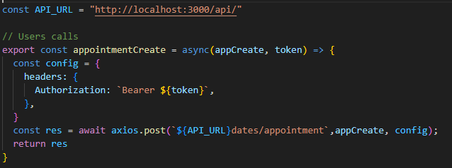
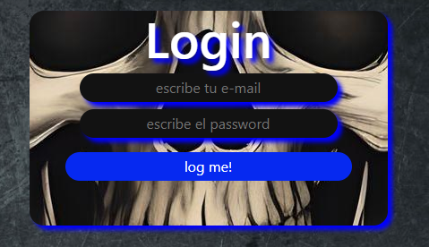
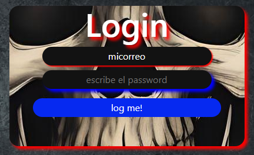
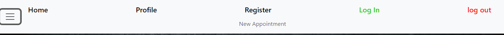
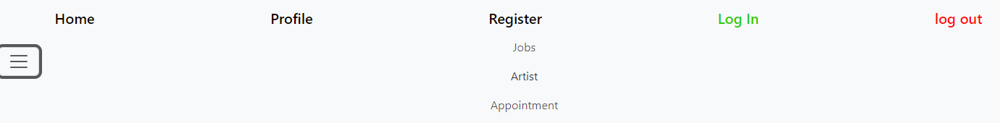
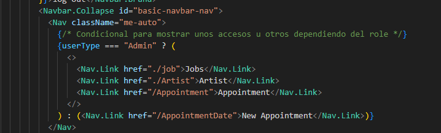
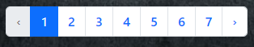

# Frontend Estudio Tattuajes

Objetivo
## El objetivo de este proyecto es crear la parte frontal de una base de datos relacional. Dentro de las diversas funciones se incluyen poder hacer un registro de usuarios, loguear, desloguear, cambiar datos de usuario, crear citas y poder modificarlas. en los aspectos de de administrador se requiere poder ver todos los usuario y citas entre otras funcionalidades implementadas.

## Tecnologías utilizadas:

    

## Sobre el proyecto.
Este proyecto es para hacer la parte visual de una base de datos.
El primer paso es instalar las diferentes dependencias React, Redux etc.
Entre otros pasos Hemos realizado la conexion con nuestra BD y rutas al backend 
  
En la pagina de Login implementamos de manera visual un cambio si algun campo no es correcto.
  
La barra de navegacion pinta unas rutas u otras dependiendo del rol de usuario. 
Usuario.
 
Admin.
 
Esto lo logramos con un coondicional.
 
Las tablas en Admin de Usuarios y citas cuentan con una paginación
 
A demas el Admin puede eliminar usuarios y citas ajenas 

## Actualizaciones futuras

Implementacion de avisos de errores en Registro y login.
Funcionalidad en Contacto, un formulario para que el usuario exprese su feedback de la app.
Implementar borrado de citas.
Implementar una barra de busqueda dinámica
Un estilo visual mas atractivo.
Hacer responsive la app.

## Link al repositorio Front-end

[Click aqui](https://github.com/AlbertoPueblas/Frontend-studio-tatto)

## Link al repositorio Back-end

[Click aqui](https://github.com/AlbertoPueblas/Backend-studio-tatto)
